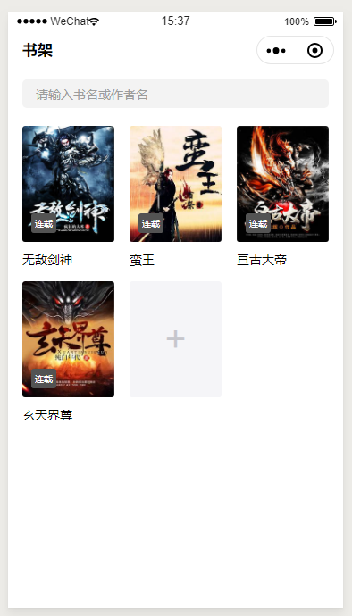

# 小说阅读器
小程序版的一个简单的阅读器, 使用简单的方式实现, 主要数据存储在Localstorage

### 页面
- 书架页(首页)
- 搜索页(包含搜索结果)
- 书本详情页
- 阅读器部分

### 数据来源
使用的是书旗网手机版的api, http://t.shuqi.com/route.php?pagename=

### 阅读器功能介绍
- 章节列表
- 亮度调整
- 章节切换
- 懒加载切换章节
- 阅读器设置(字体, 字号, 背景, 夜间模式, 护眼模式)

### 页面展示

#### 书架

#### 搜索页

#### 书本详情

#### 阅读器部分

